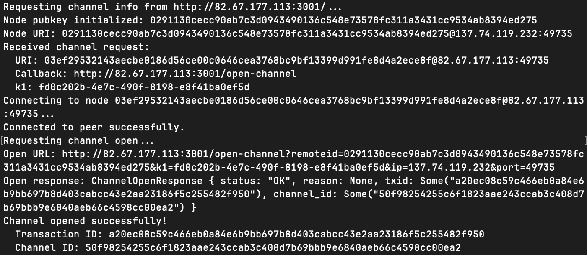
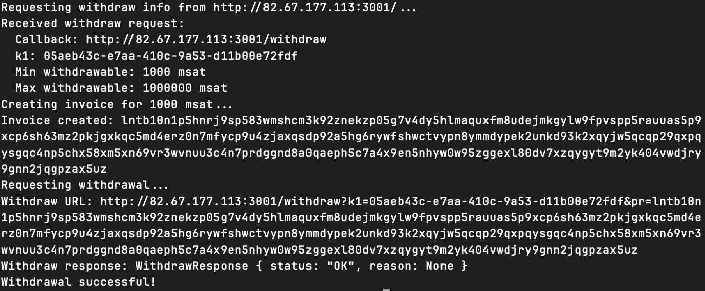

# LNURL Rust Project

A Rust implementation of the LNURL protocol (LUD-01, LUD-03, LUD-04) on Bitcoin Testnet4, interacting with Core Lightning (CLN).

## 🌍 Public Server Info

**The server is deployed publicly and is fully accessible for testing by anyone.** You do not need to run the server locally, and you do not need to connect through the WireGuard VPN to test the client.

* **Server Base URL:** `http://137.74.119.232:3000`
* **Lightning Node URI:** `0291130cecc90ab7c3d0943490136c548e73578fc311a3431cc9534ab8394ed275@137.74.119.232:49735`

---

## 1. Project Configuration

Configuration is currently defined in the source files.

* **Server (`lnurl-server/src/main.rs`):**
* Listens on: `0.0.0.0:3000` (Public Internet)
* CLN RPC: `/home/ubuntu/.lightning/testnet4/lightning-rpc`


* **Client (`lnurl-client/src/main.rs`):**
* **Note:** If running the client locally, you **must** update the `CLN_RPC_PATH` constant in `main.rs` to point to your local CLN `lightning-rpc` file.
* Public IP: Updated to match the client's listening address.

---

## 2. Server Status

The server is running as a systemd service on a public VPS.

```bash
# Check service status on VPS
sudo systemctl status lnurl-server

# View live logs
sudo journalctl -u lnurl-server -f
```

---

## 3. Running the Client (Tests)

**Prerequisites:**

1. A running Core Lightning (CLN) node on Testnet4.
2. `CLN_RPC_PATH` updated in `lnurl-client/src/main.rs`.
3. Rust (`cargo`) installed.

### A. Interoperability Test (Request Channel)

Requests the public server to open a channel to your local node.

```bash
cargo run --bin lnurl-client -- request-channel http://137.74.119.232:3000
```

### B. Withdraw Test

Requests the public server to pay an invoice (1000 msat) to your node.

```bash
cargo run --bin lnurl-client -- request-withdraw http://137.74.119.232:3000 1000
```

### C. Auth Test

Performs a cryptographic handshake/login with the server.

```bash
cargo run --bin lnurl-client -- request-auth http://137.74.119.232:3000
```

---

## 4. Screenshots from the client calling the server running at 82.67.177.113:3001

### A. Request a channel


### B. Request a withdraw
